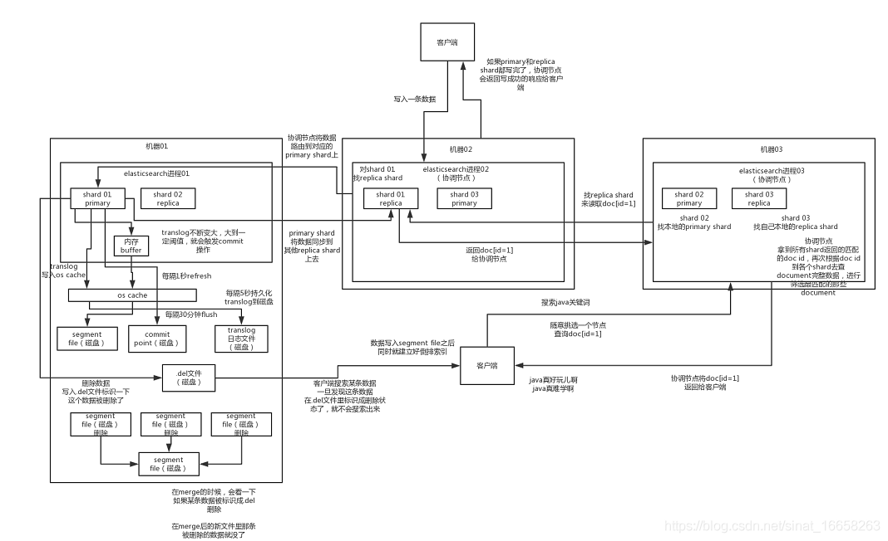

# elasticsearch集群搭建
Elasticsearch 是一个接近实时的搜索平台。这意味着，从索引一个文档直到这个文档能够被搜索到有一个很小的延迟（通常是 1 秒）。

----------
## 目录
* [1.概述](## 1.概述)
	* 1.1 系统依赖
    * 1.2 安装包
    * 1.3 elasticsearch集群
* [2.快速部署](## 2.快速部署)
    * 2.1 elasticsearch集群
    * 2.2 安装elasticsearch
    * 2.3 配置elasticsearch集群
    * 2.4 配置jvm信息
    * 2.5 创建相关目录
    * 2.6 启动服务
* [3.测试](## 3.测试)
* [参考链接](## 参考链接) 

----------

### 1. 概述：
Elasticsearch的功能:
（1）分布式的搜索引擎和数据分析引擎；
（2）全文检索，结构化检索，数据分析；
（3）对海量数据进行近实时的处理。

[点击了解Elasticsearch技术原理](https://blog.csdn.net/sinat_16658263/article/details/90444038?utm_medium=distribute.pc_relevant.none-task-blog-BlogCommendFromMachineLearnPai2-3.channel_param&depth_1-utm_source=distribute.pc_relevant.none-task-blog-BlogCommendFromMachineLearnPai2-3.channel_param)

#### 1.1 系统依赖
- Java 8
- elasticsearch 7
- Centos 7

#### 1.2 安装包
[点击获取elasticsearch安装程序](./install/elasticsearch-7.5.1-x86_64.rpm)，大小约50.3M左右。

#### 1.3 elasticsearch集群
CPU： 8  Intel(R) Xeon(R) CPU E5-2670 0 @ 2.60GHz
内存： 16G 
磁盘空间：245G

| 服务器         | hostname      |config path    |
| ------------- |:-------------:|:-------------:|
| 10.101.3.107  |  sh107.shahu.com  |/etc/elasticsearch |
| 10.101.3.108  |  sh108.shahu.com  |/etc/elasticsearch |
| 10.101.3.109  |  sh109.shahu.com  |/etc/elasticsearch |

### 2.快速部署：
在服务器上安装jdk1.8，由于系统模板已经集成jdk 1.8.0_262-b10,所以这里不在单独安装。
> 安装思路：采取逐台安装的策略。每台机器上先配置elasticsearch.yml，再配置jvm.options，分配虚拟用户组然后启动。

#### 2.1 下载elasticsearch 安装程序
> 请下载1.2中链接的安装包程序。

#### 2.2 安装elasticsearch
安装命令：

	yum install -y elasticsearch-7.5.1-x86_64.rpm

#### 2.3 配置elasticsearch集群
> es集群配置文件为elasticsearch.yml，注意对应修改每台服务器上的hostname，请留意一下配置的注释说明。

备份默认配置：

	# 备份默认配置
	cp /etc/elasticsearch/elasticsearch.yml /etc/elasticsearch/elasticsearch.yml.bak
	# 注释掉elasticsearch.yml所有配置
	vim /etc/elasticsearch/elasticsearch.yml

修改如下：

	# 定义集群名称
    cluster.name: skywalking
	# 本机的hostname，hostname指令查看本机的主机名
	node.name: sh107.shahu.com
	node.master: true
	node.data: true
	# data和logs目录，应该放在空间较大的数据盘，避免放入系统盘
	path.data: /appdata/elasticsearch/data
	path.logs: /appdata/elasticsearch/logs
	network.host: 0.0.0.0
	http.port: 9200
	# 集群的host
	discovery.zen.ping.unicast.hosts: ["10.101.3.107", "10.101.3.108", "10.101.3.109"]
	# 集群的hostname
	cluster.initial_master_nodes: ["sh107.shahu.com", "sh108.shahu.com", "sh109.shahu.com"]
	discovery.zen.minimum_master_nodes: 2

#### 2.4 配置jvm信息
> 集群中每个节点的jvm.options配置是一样的，可以选择远程拷贝。

备份默认配置：

	# 备份默认配置
	cp /etc/elasticsearch/jvm.options /etc/elasticsearch/jvm.options.bak
	# 修改jvm.options配置
	vim /etc/elasticsearch/elasticsearch.yml

修改如下：

	-Xms4g 
	-Xmx4g
	-XX:+UseConcMarkSweepGC
	-XX:CMSInitiatingOccupancyFraction=75
	-XX:+UseCMSInitiatingOccupancyOnly
	-Djava.io.tmpdir=${ES_TMPDIR}
	-XX:+HeapDumpOnOutOfMemoryError
	# /appdata为数据盘路径
	-XX:HeapDumpPath=/appdata/elasticsearch
	-XX:ErrorFile=/appdata/elasticsearch/logs/hs_err_pid%p.log
	9-:-Xlog:gc*,gc+age=trace,safepoint:file=/appdata/elasticsearch/logs/gc.log:utctime,pid,tags:filecount=32,filesize=64m

#### 2.5 创建相关目录
创建elasticsearch的数据目录和日志目录并设置权限
	
	# elasticsearch的data和log目录创建在数据盘目录/appdata/
	mkdir -p  /appdata/elasticsearch/data
	mkdir -p  /appdata/elasticsearch/logs
	chown -R elasticsearch:elasticsearch /appdata/elasticsearch

#### 2.6 启动服务
启动指令：

	# 查看进程是否启动，可以用这个命令ps -ax | grep elasticsearch
	systemctl start elasticsearch

启动成功后无打印

关闭指令：

	systemctl stop elasticsearch

### 3.验证服务：
查看集群状态：
	
	# 查看集群状态
	curl 10.101.3.107:9200/_cluster/stats?pretty

查询返回：

查看节点状态：

	# 查看节点
	curl 10.101.3.107:9200/_nodes/process?pretty

查询返回：

## 参考链接
- ElasticSearch5.1 基本概念和配置：https://my.oschina.net/Yumikio/blog/805877

